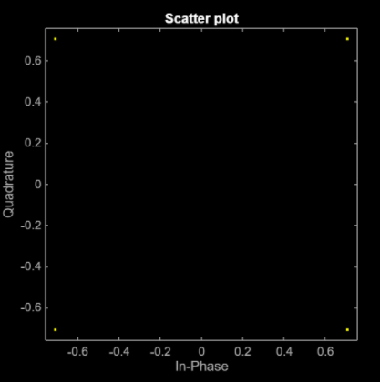
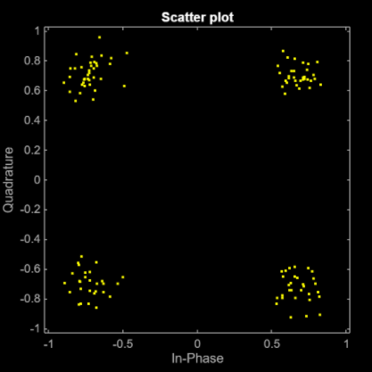

# Simulazione-Numerica-OFDM
Questo progetto MATLAB implementa la simulazione numerica di un sistema di trasmissione OFDM con modulazioni PSK e QAM, utilizzando un canale rumoroso.

Analizzando il notebook MATLAB è possibile osservare passo passo i risultati della simulazione nei diversi stadi del sistema di trasmissione,
di seguito è possibile osservare lo scatterplot per un modulazione 4-PSK/4-QAM prima del canale rumoroso e successivamente a quest'ultimo.

